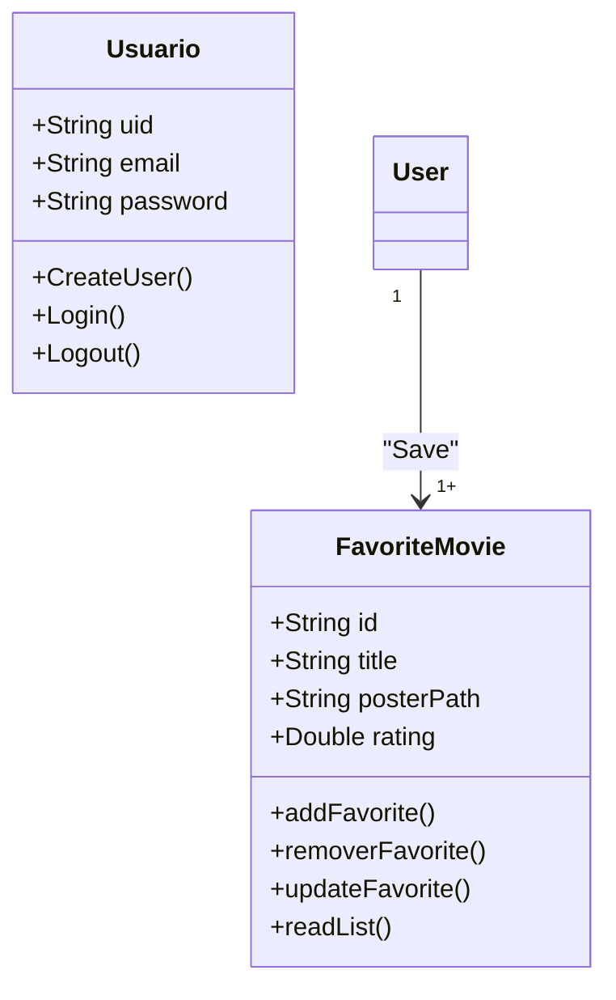
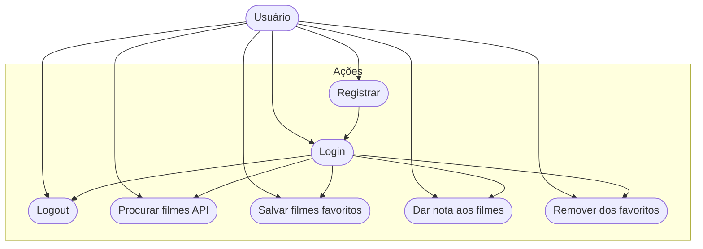

# CineFavorite - Formativa
Construir um Aplicativo do Zero - O CineFavorite permitirá criar uma conta e buscar filmes em uma API e montar uma galeria pessoal de filmes favoritos , com posters e notas

## Objetivos
- Criar uma galeria Personalizada por Usuário de Filmes Favoritos 
- Conectar o app com uma API de Filmes
- Permitir a Criação de Contas para cada Usuário
- Listar Filmes por Palavra-Chave


## levantamento de Requisitos do Projeto

- ### Funcionais 
- Salvar filmes favoritos
- Buscar filmes por palavra-chave
- Salvar contas de Usuários

- ### Nao Funcionais

## Recursos do Projeto 
- Flutter /Dart
- FireBase
- API TMDB
- Figma

## Diagramas 

1. ### Classes 
    Demonstrar o funcionamento das entidades do Sistema
     - Usuario (User) : classe já modelada pelo FireBaseAuth
        - email
        - password
        - uid
        - Login()
        - Create()
        - Logout()

    - FilmeFavorito: Classe modelada pelo DEV
        - number:id 
        - string:title
        - string:Poster
        - double:Rating
        - adicionar()
        - remover()
        - listar() 
        - updateNota()
    


2. ### Uso 
    Ações que os Atores podem Fazer 
    - User:
       - Registrar
       - Login
       - Logout
       - Procurar filmes API
       - Salvar filmes favoritos
       - Dar nota aos filmes 
       - Remover dos favoritos



3. ### Fluxo 
    Determina o Caminho percorrito pelo ator para executar uma ação
    - Ação de login 

```mermaid

  graph TD  

    A[Ínicio] --> B {Login Usuário}
    B --> C[Inserir Email e Senha] 
    C --> D{Validar as Credenciais}
    D --> E[Sim]
    E --> F[Tela de Favoritos]
    D --> G[Não]
    G --> B
```


## Prototipagem 

## Codificação 